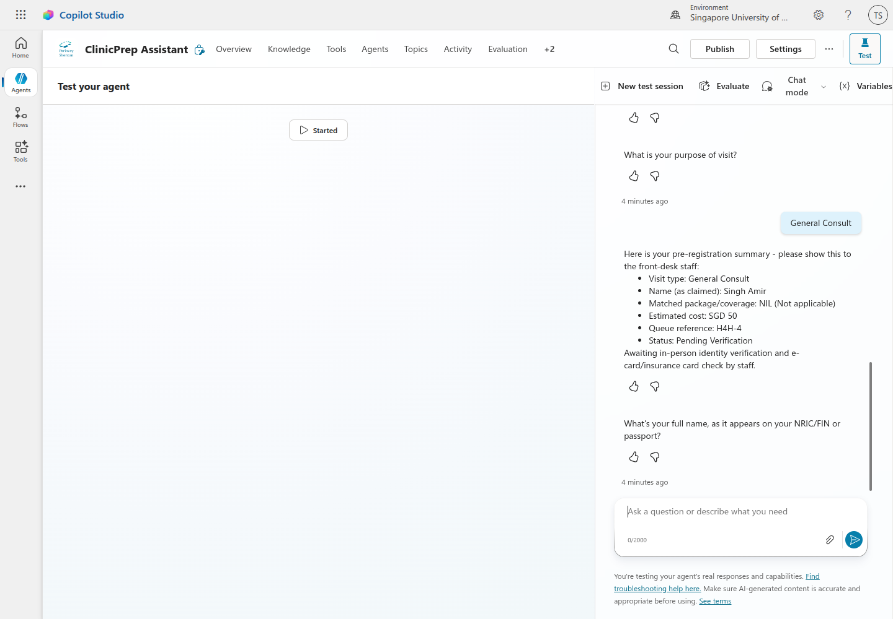
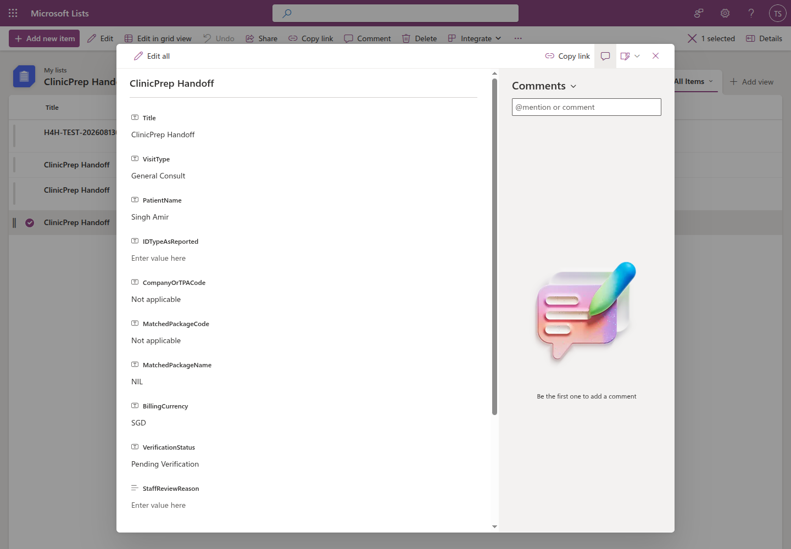

<p align="center">
  <video src="https://github.com/user-attachments/assets/9141a34d-998a-47a5-8383-999e7cb88d17" controls width="720" poster="https://img.youtube.com/vi/TqB2ibZvX5Y/hqdefault.jpg">
    Your Markdown viewer doesn't support inline video playback — <a href="https://youtu.be/TqB2ibZvX5Y">watch the demo on YouTube</a> instead.
  </video>
</p>

# ClinicPrep Assistant — Hack4Health 2026 Technical Track Submission

<p align="center">
  
</p>

**Automating pre-registration and eligibility verification so patients arrive pre-verified, and staff spend their time on people, not paperwork.**

Clinic staff currently spend **~23–32 minutes of administrative work per patient** (~18 cumulative
hours for 40 patients/morning) interpreting non-standard insurer/TPA paperwork, checking CHAS/insurance
eligibility, matching screening packages, re-collecting details already on file, determining billing,
and re-keying data into TPA portals. **ClinicPrep Assistant** is a Microsoft Copilot Studio agent that
moves all of that work to before the patient reaches the counter — while keeping identity verification
and e-card/insurance-card validation exactly where they belong: in person, with staff.

> 📄 **Official submission document:** [Submission/TECHNICAL_TRACK_SUBMISSION.md](Submission/TECHNICAL_TRACK_SUBMISSION.md) ([PDF](Submission/TECHNICAL_TRACK_SUBMISSION.pdf) · [HTML](Submission/TECHNICAL_TRACK_SUBMISSION.html))

## Contents

- [1. What the solution does](#1-what-the-solution-does)
- [2. Architecture](#2-architecture)
- [3. Prototype evidence](#3-prototype-evidence)
- [4. Repository structure](#4-repository-structure)
- [5. The challenge brief](#5-the-challenge-brief)
- [6. Judging rubric alignment](#6-judging-rubric-alignment)
- [7. Data & synthetic datasets](#7-data--synthetic-datasets)
- [8. PDPA & synthetic data note](#8-pdpa--synthetic-data-note)
- [9. Team](#9-team)

## 1. What the Solution Does

A patient starts a chat (web link, kiosk, or Teams) before their visit and:

1. **Uploads a referral/insurer document** (or provides basic details if self-pay/walk-in) — the agent
   extracts the company/TPA code, policy number, requested package, and billing party.
2. **Confirms pre-filled registration details** — looked up from prior records, so nothing already on
   file has to be retyped.
3. **Matches eligibility and screening package** — CHAS tier, corporate/insurer coverage, General
   Health vs. Occupational Health package — with low-confidence or ambiguous cases escalated to staff
   rather than guessed.
4. **Completes a pre-filled consent/disclosure questionnaire** and acknowledges the PDPA declaration.
5. **Receives a billing estimate** and a **handoff reference number**.

At the counter, staff see a ready-to-verify summary — claimed identity, matched package, payable
amount, and any flags — and complete the one step that must always stay human and in-person: **identity
and e-card/insurance-card verification.**

## 2. Architecture

<p align="center">
  
</p>

Copilot Studio generative orchestration plus nine classic topics drive the conversation. Document
parsing, patient lookup, eligibility, and billing are currently deterministic mocks (to demo the flow
without production connectors); the **handoff step is a live, published Power Automate flow** that
writes a data-minimised record to a SharePoint list and returns a `H4H-{ID}` reference. See
[docs/PLAN.md](docs/PLAN.md) for the full agent configuration and [docs/AUDIT.md](docs/AUDIT.md) for an
honest breakdown of what's live vs. mocked today.

## 3. Prototype Evidence

| Enabled, error-free topics | Live SharePoint-backed handoff | Data-minimised queue record |
| --- | --- | --- |
|  |  |  |

More screenshots (Evaluation runs, safe escalation, returning-patient registration) are in the
[Appendix of the submission document](Submission/TECHNICAL_TRACK_SUBMISSION.md#appendix---prototype-evidence)
and the raw images in [Submission/SubmissionAssets/](Submission/SubmissionAssets/).

## 4. Repository Structure

```
README.md                    This file
Submission/                  The official Technical Track deliverable (md/html/pdf) + evidence screenshots
docs/                         Working design & audit trail: PLAN, FLOW, TEST_CASE, AUDIT, WORK
CopilotStudio/                Topic YAML source + Evaluation CSVs for the live "ClinicPrep Assistant" agent
Data/                         Synthetic patient/questionnaire datasets and field-reference schemas
ProblemStatement/             Hackathon-provided brief, judging criteria, and Copilot/Agnes AI guides
Resources/                    Hack4Health 2026 programme materials (briefing, playbook, intro video)
archive/                      Superseded documents kept for history (e.g. the original working README)
```

| Folder/file | Purpose |
| --- | --- |
| [Submission/TECHNICAL_TRACK_SUBMISSION.md](Submission/TECHNICAL_TRACK_SUBMISSION.md) | The 4-page Technical Track submission (also exported as [.html](Submission/TECHNICAL_TRACK_SUBMISSION.html)/[.pdf](Submission/TECHNICAL_TRACK_SUBMISSION.pdf)) |
| [Submission/SubmissionAssets/](Submission/SubmissionAssets/) | Architecture diagram source (`.mmd`/`.svg`), evidence screenshots, and the [build script](Submission/SubmissionAssets/build-submission.mjs) that renders the submission to HTML/PDF |
| [docs/PLAN.md](docs/PLAN.md) | Copilot Studio agent configuration plan (topics, entities, actions, data model) |
| [docs/FLOW.md](docs/FLOW.md) | As-is vs. to-be process flowcharts (Mermaid) |
| [docs/TEST_CASE.md](docs/TEST_CASE.md) | Evaluation test cases, mock action contracts, and pass criteria |
| [docs/AUDIT.md](docs/AUDIT.md) | Independent audit of what's live vs. simulated, against the judging rubric |
| [docs/WORK.md](docs/WORK.md) | Build/repair session log for the Copilot Studio topics |
| [CopilotStudio/README.md](CopilotStudio/README.md) | Deployment notes, topic IDs, and hybrid mock/live action mode |
| [CopilotStudio/topics/](CopilotStudio/topics/) | Reference YAML for the 9 deployed topics |
| [Data/](Data/) | Synthetic registration & questionnaire CSVs, field-reference schema, sample medical chit letters |
| [ProblemStatement/](ProblemStatement/) | Original hackathon brief, non-technical brief, judging criteria, Copilot & Agnes AI guides, meeting recording |
| [Resources/](Resources/) | Hack4Health programme briefing, playbook, and intro-video notes |

## 5. The Challenge Brief

> **How might we automate pre-registration and eligibility verification for both scheduled
> appointments and walk-in patients, so the necessary information is retrieved and processed before
> they reach the front desk** — eliminating the need for staff to manually determine coverage,
> benefits, and screening packages — **while ensuring identity verification is still completed
> securely in person?**

Source documents (converted to Markdown for easy reading):

- [ProblemStatement/1. Technical Problem Statement.md](ProblemStatement/1.%20Technical%20Problem%20Statement.md) — the challenge brief
- [ProblemStatement/3. Hack4Health Judging Criteria.md](ProblemStatement/3.%20Hack4Health%20Judging%20Criteria.md) — submission template & scoring rubric
- [ProblemStatement/4. Microsoft Copilot Guide.md](ProblemStatement/4.%20Microsoft%20Copilot%20Guide.md) — Copilot Studio / agents background
- [ProblemStatement/5. Agnes AI Set Up Guide.md](ProblemStatement/5.%20Agnes%20AI%20Set%20Up%20Guide.md) — model showcase deck referenced as an available model/API provider
- [Data/Parkway_Shenton_Questionnaires_Field_Reference.md](Data/Parkway_Shenton_Questionnaires_Field_Reference.md) — full field schema for the two screening questionnaires
- [Data/Sample Medical Chit Letters (v2).md](Data/Sample%20Medical%20Chit%20Letters%20(v2).md) — sample insurer/TPA documents to parse

**Constraints that shaped the design:** must be portable to Microsoft Copilot Studio; identity
verification and e-card validation stay manual and in-person; operational cost must be realistic;
everything else (document interpretation, eligibility checks, package matching, registration data
entry) is fair game to automate.

## 6. Judging Rubric Alignment

| Criterion | Weight | Where it's addressed |
| --- | --- | --- |
| Problem Understanding | 20 | [Submission/TECHNICAL_TRACK_SUBMISSION.md](Submission/TECHNICAL_TRACK_SUBMISSION.md) §3, [docs/FLOW.md](docs/FLOW.md) |
| Operational Impact | 20 | [Submission/TECHNICAL_TRACK_SUBMISSION.md](Submission/TECHNICAL_TRACK_SUBMISSION.md) §7 |
| Technical Feasibility & Integration | 15 | [Submission/TECHNICAL_TRACK_SUBMISSION.md](Submission/TECHNICAL_TRACK_SUBMISSION.md) §6, [docs/PLAN.md](docs/PLAN.md), [CopilotStudio/](CopilotStudio/) |
| Innovation | 15 | [Submission/TECHNICAL_TRACK_SUBMISSION.md](Submission/TECHNICAL_TRACK_SUBMISSION.md) §4 |
| User Experience | 10 | [Submission/TECHNICAL_TRACK_SUBMISSION.md](Submission/TECHNICAL_TRACK_SUBMISSION.md) §5 |
| Governance & Safety | 10 | [Submission/TECHNICAL_TRACK_SUBMISSION.md](Submission/TECHNICAL_TRACK_SUBMISSION.md) §9 |
| Scalability | 10 | [Submission/TECHNICAL_TRACK_SUBMISSION.md](Submission/TECHNICAL_TRACK_SUBMISSION.md) §10 |

An independent, evidence-based self-audit against this rubric (including what remains mocked vs.
live) is in [docs/AUDIT.md](docs/AUDIT.md).

## 7. Data & Synthetic Datasets

| File | Purpose |
| --- | --- |
| [Data/patient_registration_synthetic.csv](Data/patient_registration_synthetic.csv) | Synthetic patient registration records (identity, contact, drug allergy) |
| [Data/general_health_questionnaire_mock_patients.csv](Data/general_health_questionnaire_mock_patients.csv) | Mock completed General Health screening questionnaires |
| [Data/occupational_health_questionnaire_mock_patients.csv](Data/occupational_health_questionnaire_mock_patients.csv) | Mock completed Occupational Health screening questionnaires |
| [Data/Parkway_Shenton_Questionnaires_Field_Reference.md](Data/Parkway_Shenton_Questionnaires_Field_Reference.md) | Full field-by-field schema for both questionnaires |
| [Data/Sample Medical Chit Letters (v2).md](Data/Sample%20Medical%20Chit%20Letters%20(v2).md) | Sample synthetic insurer/TPA referral letters, vouchers, and authorisation forms to parse |
| [CopilotStudio/evaluation-conversations.csv](CopilotStudio/evaluation-conversations.csv), [CopilotStudio/evaluation-safety.csv](CopilotStudio/evaluation-safety.csv) | Copilot Studio Evaluation sets used to score the live agent |

## 8. PDPA & Synthetic Data Note

All CSVs and sample documents in this repository are **synthetic/fictional** and intended only for
building and testing this prototype. No real patient or insurer data was used. The submitted solution
still addresses PDPA compliance, human oversight, and hallucination mitigation as required in the
Governance & Safety section of the submission — see
[Submission/TECHNICAL_TRACK_SUBMISSION.md](Submission/TECHNICAL_TRACK_SUBMISSION.md#9-governance-and-safety).

## 9. Team

| Field | Details |
| --- | --- |
| Team name | *DaLongBao* |
| Institution | *Singapore University of Technology and Design (SUTD)* |
| Members | *Deborah Tabile; Lee Cheng Yong; Timothy Seah; Zachary Muk* |
| Method of Contact | *Open a Pull Request!* |
