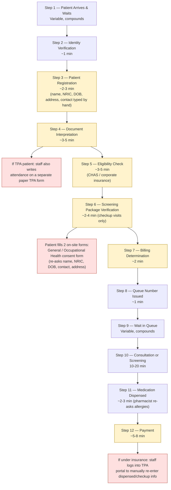
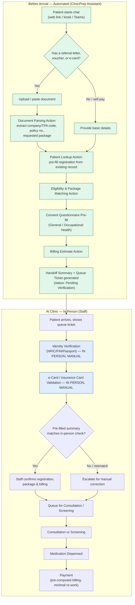
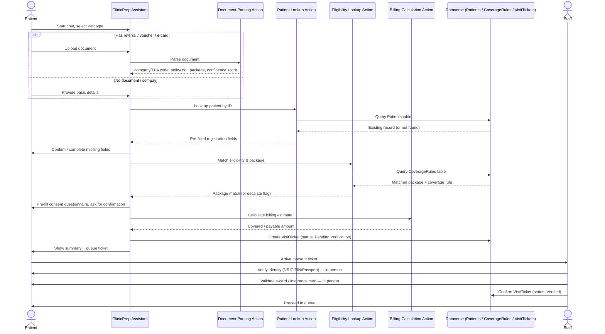

# End-to-End Patient Process — Flowcharts

Visualizes the current (as-is) clinic registration process from [1. Technical Problem Statement.md](../ProblemStatement/1.%20Technical%20Problem%20Statement.md) and the proposed (to-be) flow using the `ClinicPrep Assistant` agent from [PLAN.md](PLAN.md).

## 1. As-Is Process (Current, Manual)

Red nodes = duplicate/paper-based pain points. Yellow nodes = administrative work that happens sequentially at the registration counter.

**Admin time per patient: ~23–32 minutes**, excluding the clinical visit itself (see Technical Problem Statement).

## 2. To-Be Process (With ClinicPrep Assistant)

Green = automated before the patient reaches the counter. Blue = must stay manual/in-person (identity + e-card verification are never automated).

## 3. Sequence Diagram — Pre-Registration Interaction

Shows how the agent, its actions, Dataverse, and staff interact (maps to the topics/actions defined in [PLAN.md](PLAN.md)).

## 4. Time Impact Summary

| Stage | As-Is | To-Be |
| --- | --- | --- |
| Registration + document interpretation + eligibility + package verification + billing | ~10–19 min at the counter | Done before arrival via chat; staff only confirms |
| TPA dual paper record | Extra manual write-up (step 4) | Eliminated — captured once digitally |
| Consent questionnaires (General/Occupational Health) | Filled on-site, re-asking known details | Pre-filled before arrival, patient just confirms |
| Post-visit TPA portal re-entry | ~5–8 min manual re-entry (step 12) | Same data reused from `VisitTicket`, no re-typing |
| Identity + e-card verification | ~1 min, manual | Unchanged — stays manual, in person (by design constraint) |

See [README.md](../README.md) for the full Technical Track requirements and [PLAN.md](PLAN.md) for the agent configuration that implements this flow.
